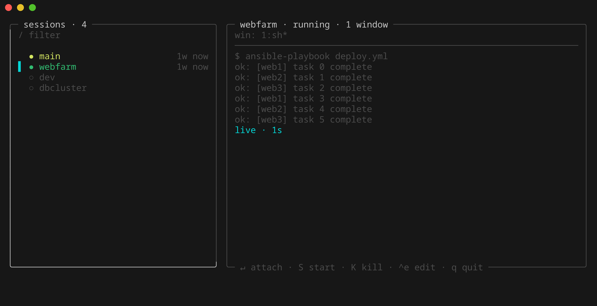
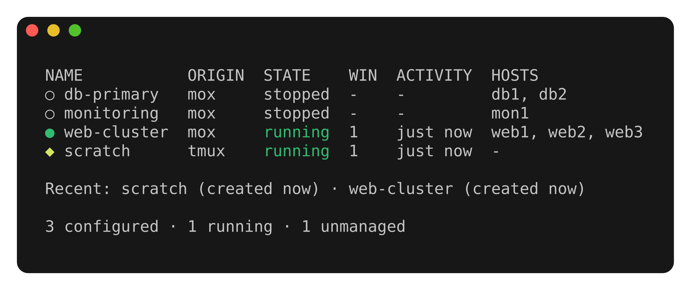
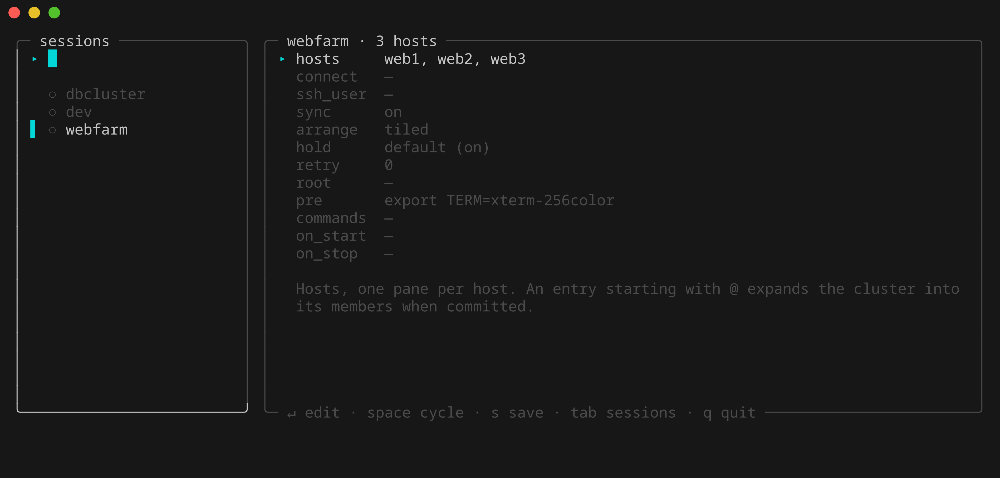

<p align="center">
  
</p>

<h1 align="center">mox</h1>

<p align="center">
  <a href="https://github.com/bthall/mox/actions/workflows/ci.yml"></a>
  <a href="https://github.com/bthall/mox/releases/latest"></a>
  <a href="https://pkg.go.dev/github.com/bthall/mox"></a>
  <a href="LICENSE"></a>
</p>

mox builds and manages tmux sessions from declarative YAML, with
cssh-style multi-host broadcast built in. Define a session once, then
start, attach, edit, or kill it by name. Ad-hoc sessions work straight
from the command line, no config required.

Bare `mox` opens the session hub. Live previews of running sessions,
with start, kill, and edit in place:

<p align="center">
  
</p>

Or see everything at a glance with `mox list`:

<p align="center">
  
</p>

Edit any session without touching YAML using `mox edit <session>`:

<p align="center">
  
</p>

## Features

- **Declarative YAML config**: one window per host, full custom layouts, or anything between; project-local `.mox.yml` overrides; editor autocomplete via a published JSON Schema
- **Cssh-style broadcast**: `sync: true` for synchronized typing; tiled layouts; `sudo -i` once for every pane
- **Ad-hoc sessions**: `mox new @cluster` or `mox new host1 host2` without touching config; `-x` excludes hosts; `--save` keeps the definition
- **Session hub**: bare `mox` opens a full-screen hub with a filterable session list, live buffer previews of running sessions, and start/kill/edit/import actions in place
- **Config without YAML**: `mox edit <session>` opens a full-screen editor with buffered drafts, a validated diff preview before anything is written, and comment-preserving saves; `mox add` walks a short wizard; `mox import` captures a running session (structure, pane geometry, *and its SSH connections*)
- **Broadcast safety**: an ended connection holds its pane instead of dropping to a local shell; optional retry
- **Lifecycle hooks**: `on_start`/`on_stop` run locally around a session; `pre` seeds every pane
- **Recents**: `mox recent` remembers what you used; `mox last` is `cd -` for sessions
- **Dry-run**: `--print` shows the exact tmux commands without running them
- **Honest defaults**: single binary, no daemon, strict config validation; the only state is a small recents history

## Install

```bash
# Go
go install github.com/bthall/mox/cmd/mox@latest

# From source (also installs shell completion)
git clone https://github.com/bthall/mox.git && cd mox && make install

# Arch Linux (source build)
cd packaging/aur && makepkg -si
```

Pre-built archives for linux/macOS × amd64/arm64 are attached to each
[release](https://github.com/bthall/mox/releases) with `checksums.txt`.

## Quick start

```bash
mox init                        # scaffold a config at ~/.config/mox/config.yml
mox add                         # interactively add a session to it
mox edit                        # full-screen session editor
mox edit example                # same, with a session pre-selected
mox -a example                  # build + attach to the "example" session
mox                             # or open the session hub
mox new @webfarm                # ad-hoc broadcast session on a cluster
mox kill example                # destroy a running session
```

## Documentation

- **[Configuration](docs/configuration.md)**: the YAML schema (sessions, windows, layouts, connect templates, hooks, holding/retry, validation rules)
- **[Commands](docs/commands.md)**: every command and flag, the session hub, cluster expansion, dry-run, shell completion
- **[Recipes](docs/recipes.md)**: copy-paste workflows, from quick local sessions to clusterssh migration

## Contributing

`make test`, `make lint`, and `make integration` cover the local loop; CI
runs all three plus govulncheck on every push. See
[`CONTRIBUTING.md`](CONTRIBUTING.md) and [`SECURITY.md`](SECURITY.md).

## License

MIT
